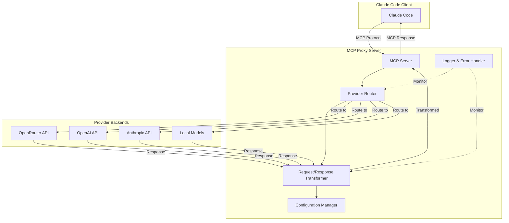
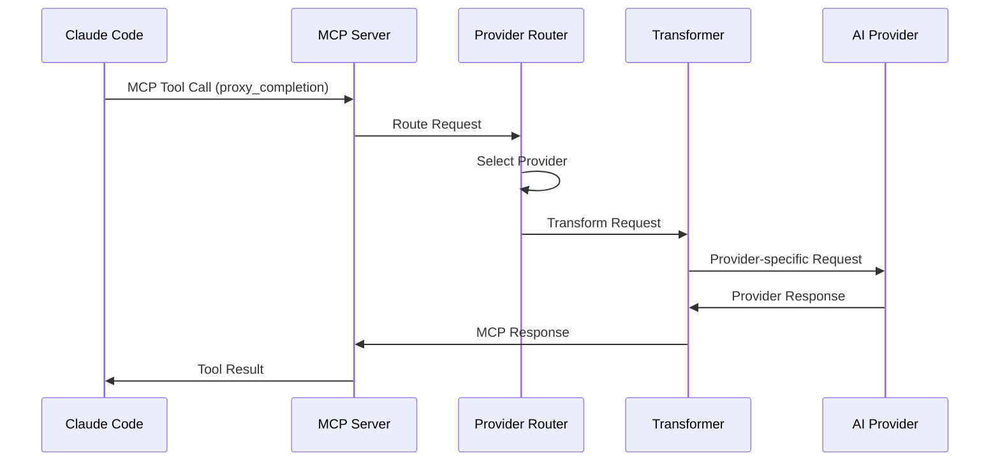
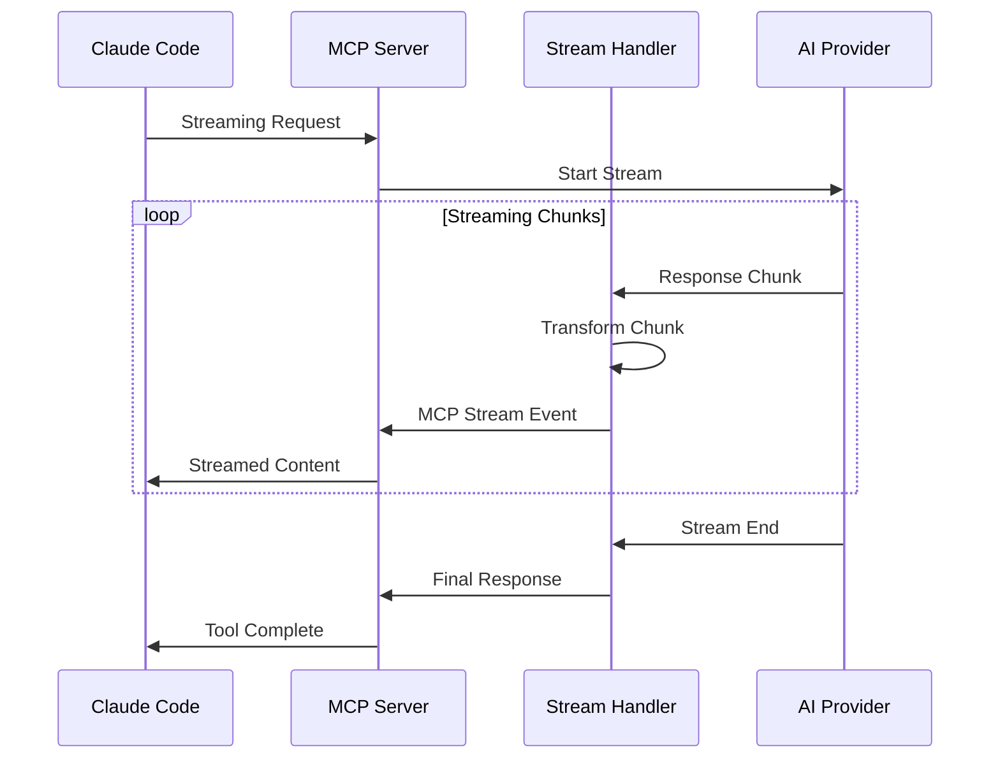

# MCP Proxy Server Architecture

## Overview

This document outlines the architecture for transforming the existing cproxy server into a Model Context Protocol (MCP) server that can proxy Claude Code requests to multiple providers (OpenRouter, OpenAI, Anthropic, etc.).

## System Architecture

### High-Level Architecture Diagram



### Core Components

#### 1. MCP Server Core (`McpServer`)
- **Purpose**: Handle MCP protocol communication with Claude Code
- **Framework**: `@modelcontextprotocol/sdk`
- **Transport**: `StdioServerTransport` (primary) + HTTP transport (optional)
- **Responsibilities**:
  - Protocol compliance with MCP specification
  - Tool registration for proxy operations
  - Resource management for provider configurations
  - Connection lifecycle management

#### 2. Provider Router (`ProviderRouter`)
- **Purpose**: Route requests to appropriate backend providers
- **Responsibilities**:
  - Provider selection based on model, cost, availability
  - Load balancing across multiple instances
  - Failover and retry logic
  - Provider health monitoring

#### 3. Request/Response Transformer (`MessageTransformer`)
- **Purpose**: Transform between MCP format and provider-specific formats
- **Responsibilities**:
  - MCP to Anthropic/OpenAI/OpenRouter format conversion
  - Response format standardization
  - Streaming response handling
  - Tool call transformation

#### 4. Configuration Manager (`ConfigManager`)
- **Purpose**: Manage provider configurations and routing rules
- **Responsibilities**:
  - Provider endpoint management
  - API key and authentication handling
  - Model mapping and capabilities
  - Dynamic configuration reloading

#### 5. Logger & Error Handler (`LoggerService`)
- **Purpose**: Comprehensive logging and error management
- **Responsibilities**:
  - Request/response logging
  - Performance metrics
  - Error tracking and reporting
  - Debug information for troubleshooting

## Detailed Component Design

### 1. MCP Server Structure

```typescript
// src/mcp/McpProxyServer.ts
import { McpServer } from "@modelcontextprotocol/sdk/server/mcp.js";
import { StdioServerTransport } from "@modelcontextprotocol/sdk/server/stdio.js";

export class McpProxyServer {
  private server: McpServer;
  private providerRouter: ProviderRouter;
  private transformer: MessageTransformer;
  private config: ConfigManager;
  private logger: LoggerService;

  constructor() {
    this.server = new McpServer({
      name: "claude-code-proxy",
      version: "2.0.0",
      description: "MCP proxy server for Claude Code to multiple AI providers"
    });
  }

  async initialize(): Promise<void> {
    // Register MCP tools and resources
    await this.registerTools();
    await this.registerResources();
    
    // Setup transport
    const transport = new StdioServerTransport();
    await this.server.connect(transport);
  }

  private async registerTools(): Promise<void> {
    // Register proxy completion tool
    this.server.registerTool("proxy_completion", {
      title: "AI Provider Proxy",
      description: "Route completion requests to configured AI providers",
      inputSchema: {
        messages: z.array(z.object({
          role: z.enum(["system", "user", "assistant"]),
          content: z.string()
        })),
        model: z.string().optional(),
        provider: z.string().optional(),
        stream: z.boolean().optional(),
        tools: z.array(z.any()).optional()
      }
    }, async (params) => {
      return await this.handleProxyRequest(params);
    });
  }
}
```

### 2. Provider Router Design

```typescript
// src/providers/ProviderRouter.ts
export interface ProviderConfig {
  id: string;
  name: string;
  baseUrl: string;
  apiKey?: string;
  models: string[];
  capabilities: {
    streaming: boolean;
    tools: boolean;
    reasoning: boolean;
  };
  rateLimits: {
    requestsPerMinute: number;
    tokensPerMinute: number;
  };
  priority: number;
  healthCheck: {
    endpoint: string;
    interval: number;
  };
}

export class ProviderRouter {
  private providers: Map<string, ProviderConfig>;
  private healthStatus: Map<string, boolean>;
  private requestCounts: Map<string, number>;

  constructor(private config: ConfigManager, private logger: LoggerService) {}

  async routeRequest(request: ProxyRequest): Promise<ProviderConfig> {
    // 1. Model-based routing
    if (request.model) {
      const provider = this.findProviderByModel(request.model);
      if (provider && this.isProviderHealthy(provider.id)) {
        return provider;
      }
    }

    // 2. Capability-based routing
    const requiredCapabilities = this.analyzeRequestCapabilities(request);
    const compatibleProviders = this.findProvidersByCapabilities(requiredCapabilities);

    // 3. Load balancing with priorities
    return this.selectOptimalProvider(compatibleProviders);
  }

  private selectOptimalProvider(providers: ProviderConfig[]): ProviderConfig {
    // Weighted selection based on:
    // - Provider priority
    // - Current load
    // - Response time history
    // - Cost efficiency
    return providers.sort((a, b) => {
      const scoreA = this.calculateProviderScore(a);
      const scoreB = this.calculateProviderScore(b);
      return scoreB - scoreA;
    })[0];
  }
}
```

### 3. Message Transformer Design

```typescript
// src/transformers/MessageTransformer.ts
export class MessageTransformer {
  constructor(private logger: LoggerService) {}

  async transformRequest(
    mcpRequest: MCPCompletionRequest,
    targetProvider: ProviderConfig
  ): Promise<ProviderRequest> {
    switch (targetProvider.id) {
      case 'openrouter':
        return this.transformToOpenAI(mcpRequest);
      case 'anthropic':
        return this.transformToAnthropic(mcpRequest);
      case 'openai':
        return this.transformToOpenAI(mcpRequest);
      default:
        throw new Error(`Unsupported provider: ${targetProvider.id}`);
    }
  }

  async transformResponse(
    providerResponse: ProviderResponse,
    sourceProvider: ProviderConfig,
    streaming: boolean = false
  ): Promise<MCPCompletionResponse> {
    if (streaming) {
      return this.transformStreamingResponse(providerResponse, sourceProvider);
    }

    switch (sourceProvider.id) {
      case 'openrouter':
      case 'openai':
        return this.transformFromOpenAI(providerResponse);
      case 'anthropic':
        return this.transformFromAnthropic(providerResponse);
      default:
        throw new Error(`Unsupported provider: ${sourceProvider.id}`);
    }
  }

  private transformToAnthropic(request: MCPCompletionRequest): AnthropicRequest {
    return {
      model: request.model || 'claude-3-sonnet-20240229',
      messages: request.messages.map(msg => ({
        role: msg.role as AnthropicRole,
        content: msg.content
      })),
      max_tokens: request.maxTokens || 4096,
      temperature: request.temperature,
      stream: request.stream,
      tools: request.tools?.map(tool => ({
        name: tool.function.name,
        description: tool.function.description,
        input_schema: tool.function.parameters
      }))
    };
  }

  private transformToOpenAI(request: MCPCompletionRequest): OpenAIRequest {
    return {
      model: request.model || 'gpt-4',
      messages: request.messages,
      max_tokens: request.maxTokens,
      temperature: request.temperature,
      stream: request.stream || false,
      tools: request.tools
    };
  }
}
```

### 4. Configuration System Design

```typescript
// src/config/ConfigManager.ts
export interface ProxyConfiguration {
  server: {
    name: string;
    version: string;
    debug: boolean;
  };
  providers: ProviderConfig[];
  routing: {
    defaultProvider: string;
    fallbackProvider: string;
    loadBalancing: 'round-robin' | 'weighted' | 'least-connections';
    retryAttempts: number;
    retryDelay: number;
  };
  cache: {
    enabled: boolean;
    ttl: number;
    maxSize: number;
  };
  logging: {
    level: 'debug' | 'info' | 'warn' | 'error';
    requests: boolean;
    responses: boolean;
    performance: boolean;
  };
}

export class ConfigManager {
  private config: ProxyConfiguration;
  private watchers: Map<string, () => void> = new Map();

  constructor(configPath?: string) {
    this.loadConfiguration(configPath);
    this.setupConfigWatching();
  }

  loadConfiguration(configPath?: string): void {
    const defaultConfig = this.getDefaultConfiguration();
    
    // Load from file if provided
    if (configPath && existsSync(configPath)) {
      const fileConfig = JSON.parse(readFileSync(configPath, 'utf-8'));
      this.config = { ...defaultConfig, ...fileConfig };
    } else {
      // Load from environment variables
      this.config = this.loadFromEnvironment(defaultConfig);
    }

    this.validateConfiguration();
  }

  private loadFromEnvironment(baseConfig: ProxyConfiguration): ProxyConfiguration {
    return {
      ...baseConfig,
      providers: [
        {
          id: 'openrouter',
          name: 'OpenRouter',
          baseUrl: process.env.OPENROUTER_BASE_URL || 'https://openrouter.ai/api',
          apiKey: process.env.OPENROUTER_API_KEY,
          models: (process.env.OPENROUTER_MODELS || 'google/gemini-2.0-pro-exp-02-05:free').split(','),
          capabilities: {
            streaming: true,
            tools: true,
            reasoning: true
          },
          rateLimits: {
            requestsPerMinute: parseInt(process.env.OPENROUTER_RPM || '60'),
            tokensPerMinute: parseInt(process.env.OPENROUTER_TPM || '50000')
          },
          priority: 1,
          healthCheck: {
            endpoint: '/v1/models',
            interval: 60000
          }
        },
        // Additional providers...
      ]
    };
  }
}
```

### 5. Error Handling and Logging

```typescript
// src/services/LoggerService.ts
export class LoggerService {
  private logger: winston.Logger;

  constructor(config: ProxyConfiguration['logging']) {
    this.logger = winston.createLogger({
      level: config.level,
      format: winston.format.combine(
        winston.format.timestamp(),
        winston.format.errors({ stack: true }),
        winston.format.json()
      ),
      transports: [
        new winston.transports.Console(),
        new winston.transports.File({ filename: 'proxy-error.log', level: 'error' }),
        new winston.transports.File({ filename: 'proxy-combined.log' })
      ]
    });
  }

  logRequest(request: ProxyRequest, provider: ProviderConfig): void {
    this.logger.info('Proxy request', {
      requestId: request.id,
      provider: provider.id,
      model: request.model,
      messageCount: request.messages?.length,
      hasTools: !!request.tools?.length,
      streaming: request.stream
    });
  }

  logResponse(response: ProxyResponse, duration: number): void {
    this.logger.info('Proxy response', {
      requestId: response.requestId,
      status: 'success',
      duration,
      tokenUsage: response.usage
    });
  }

  logError(error: Error, context: any): void {
    this.logger.error('Proxy error', {
      error: error.message,
      stack: error.stack,
      context
    });
  }
}
```

## Request Flow Architecture

### 1. Incoming Request Processing



### 2. Streaming Response Flow



## File Structure

```
src/
├── mcp/
│   ├── McpProxyServer.ts       # Main MCP server implementation
│   ├── tools/                  # MCP tool definitions
│   │   ├── ProxyTool.ts
│   │   └── ConfigTool.ts
│   └── resources/              # MCP resource definitions
│       ├── ProvidersResource.ts
│       └── HealthResource.ts
├── providers/
│   ├── ProviderRouter.ts       # Provider selection and routing
│   ├── BaseProvider.ts         # Abstract provider interface
│   ├── OpenRouterProvider.ts   # OpenRouter implementation
│   ├── AnthropicProvider.ts    # Anthropic implementation
│   └── OpenAIProvider.ts       # OpenAI implementation
├── transformers/
│   ├── MessageTransformer.ts   # Request/response transformation
│   ├── AnthropicTransformer.ts # Anthropic-specific transforms
│   └── OpenAITransformer.ts    # OpenAI-specific transforms
├── config/
│   ├── ConfigManager.ts        # Configuration management
│   ├── schemas/                # Configuration schemas
│   │   └── ProxyConfig.ts
│   └── defaults.ts             # Default configurations
├── services/
│   ├── LoggerService.ts        # Logging service
│   ├── CacheService.ts         # Response caching
│   └── HealthService.ts        # Provider health monitoring
├── types/
│   ├── mcp.ts                  # MCP-specific types
│   ├── providers.ts            # Provider interface types
│   └── requests.ts             # Request/response types
├── utils/
│   ├── validation.ts           # Input validation
│   ├── retry.ts                # Retry logic
│   └── metrics.ts              # Performance metrics
└── index.ts                    # Application entry point
```

## Key Architectural Decisions

### 1. MCP Protocol Integration
- **Decision**: Use `@modelcontextprotocol/sdk` as the foundation
- **Rationale**: Ensures full MCP compatibility and future-proofing
- **Implementation**: Core MCP server with tool-based proxy interface

### 2. Provider Abstraction
- **Decision**: Abstract provider interface with pluggable implementations
- **Rationale**: Easy to add new providers and maintain existing ones
- **Implementation**: BaseProvider abstract class with provider-specific implementations

### 3. Configuration-Driven Routing
- **Decision**: JSON/YAML configuration with environment variable overrides
- **Rationale**: Flexible deployment across different environments
- **Implementation**: ConfigManager with file watching and hot reloading

### 4. Request Transformation Pipeline
- **Decision**: Separate transformation layer for each provider
- **Rationale**: Clean separation of concerns and maintainable code
- **Implementation**: MessageTransformer with provider-specific transform methods

### 5. Error Handling Strategy
- **Decision**: Comprehensive error handling with fallback providers
- **Rationale**: Ensure high availability and reliability
- **Implementation**: Retry logic, provider failover, and detailed error logging

## Security Considerations

### 1. API Key Management
- Environment variable storage
- Optional key rotation support
- Secure key validation

### 2. Request Validation
- Input sanitization
- Schema validation with Zod
- Rate limiting per provider

### 3. Logging Security
- No sensitive data in logs
- Configurable log levels
- Secure log storage

## Performance Optimization

### 1. Connection Pooling
- HTTP connection reuse
- Keep-alive connections
- Connection limits per provider

### 2. Response Caching
- Configurable TTL caching
- Cache invalidation strategies
- Memory-efficient storage

### 3. Streaming Optimization
- Efficient stream handling
- Minimal memory footprint
- Real-time response forwarding

## Monitoring and Observability

### 1. Metrics Collection
- Request/response times
- Provider performance
- Error rates and types
- Token usage tracking

### 2. Health Monitoring
- Provider health checks
- Automatic failover
- Status reporting

### 3. Debug Support
- Comprehensive logging
- Request tracing
- Development mode features

This architecture provides a robust, scalable, and maintainable foundation for the MCP proxy server while preserving the existing functionality and extending it with powerful new capabilities.