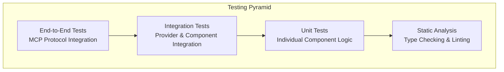

# MCP Proxy Server Testing Strategy

## Overview

This document outlines the comprehensive testing strategy for the MCP proxy server, ensuring reliability, performance, and correctness across all components and integration points.

## Testing Pyramid



## 1. Unit Testing Strategy

### 1.1 Core Components

#### MCP Server Core (`McpProxyServer`)
```typescript
// tests/unit/mcp/McpProxyServer.test.ts
describe('McpProxyServer', () => {
  it('should initialize with correct configuration');
  it('should register MCP tools correctly');
  it('should handle tool calls properly');
  it('should manage server lifecycle');
  it('should handle errors gracefully');
});
```

#### Provider Router (`ProviderRouter`)
```typescript
// tests/unit/providers/ProviderRouter.test.ts
describe('ProviderRouter', () => {
  it('should route by model name');
  it('should route by capabilities');
  it('should handle load balancing');
  it('should respect provider priorities');
  it('should handle failover scenarios');
  it('should track provider health');
});
```

#### Message Transformer (`MessageTransformer`)
```typescript
// tests/unit/transformers/MessageTransformer.test.ts
describe('MessageTransformer', () => {
  it('should transform MCP to Anthropic format');
  it('should transform MCP to OpenAI format');
  it('should handle tool transformations');
  it('should preserve message context');
  it('should handle streaming responses');
  it('should validate transformed requests');
});
```

#### Configuration Manager (`ConfigManager`)
```typescript
// tests/unit/config/ConfigManager.test.ts
describe('ConfigManager', () => {
  it('should load configuration from file');
  it('should override with environment variables');
  it('should validate configuration schema');
  it('should handle hot reloading');
  it('should provide default values');
  it('should handle configuration errors');
});
```

### 1.2 Provider Implementations

#### Base Provider
```typescript
// tests/unit/providers/BaseProvider.test.ts
describe('BaseProvider', () => {
  it('should implement abstract methods');
  it('should handle health checks');
  it('should track metrics');
  it('should handle rate limiting');
  it('should manage connection pooling');
});
```

#### OpenRouter Provider
```typescript
// tests/unit/providers/OpenRouterProvider.test.ts
describe('OpenRouterProvider', () => {
  it('should format requests correctly');
  it('should handle OpenRouter-specific headers');
  it('should transform responses properly');
  it('should handle streaming responses');
  it('should manage API key authentication');
});
```

### 1.3 Testing Framework Setup

```typescript
// jest.config.js
module.exports = {
  preset: 'ts-jest',
  testEnvironment: 'node',
  roots: ['<rootDir>/src', '<rootDir>/tests'],
  testMatch: ['**/__tests__/**/*.ts', '**/?(*.)+(spec|test).ts'],
  transform: {
    '^.+\\.ts$': 'ts-jest',
  },
  collectCoverageFrom: [
    'src/**/*.ts',
    '!src/**/*.d.ts',
    '!src/types/**/*',
  ],
  coverageDirectory: 'coverage',
  coverageReporters: ['text', 'lcov', 'html'],
  coverageThreshold: {
    global: {
      branches: 80,
      functions: 80,
      lines: 80,
      statements: 80,
    },
  },
  setupFilesAfterEnv: ['<rootDir>/tests/setup.ts'],
};
```

## 2. Integration Testing Strategy

### 2.1 Provider Integration Tests

```typescript
// tests/integration/providers/provider-integration.test.ts
describe('Provider Integration', () => {
  let mockProviders: MockProvider[];
  
  beforeEach(() => {
    mockProviders = createMockProviders();
  });

  it('should handle provider switching');
  it('should manage provider failover');
  it('should track cross-provider metrics');
  it('should handle concurrent requests');
  it('should respect rate limits across providers');
});
```

### 2.2 Configuration Integration Tests

```typescript
// tests/integration/config/config-integration.test.ts
describe('Configuration Integration', () => {
  it('should load and apply configuration changes');
  it('should validate provider configurations');
  it('should handle configuration errors gracefully');
  it('should support environment-specific configs');
});
```

### 2.3 Streaming Integration Tests

```typescript
// tests/integration/streaming/streaming-integration.test.ts
describe('Streaming Integration', () => {
  it('should handle streaming from multiple providers');
  it('should transform streaming responses correctly');
  it('should handle stream interruptions');
  it('should manage memory efficiently during streaming');
});
```

## 3. End-to-End Testing Strategy

### 3.1 MCP Protocol Compliance Tests

```typescript
// tests/e2e/mcp/protocol-compliance.test.ts
describe('MCP Protocol Compliance', () => {
  let mcpServer: McpProxyServer;
  let mcpClient: McpClient;

  beforeEach(async () => {
    mcpServer = new McpProxyServer(testConfig);
    await mcpServer.initialize();
    mcpClient = new McpClient();
    await mcpClient.connect(mcpServer);
  });

  it('should handle MCP handshake correctly');
  it('should list available tools');
  it('should execute proxy completion tool');
  it('should handle tool parameters validation');
  it('should manage MCP session lifecycle');
  it('should handle MCP errors properly');
});
```

### 3.2 Claude Code Integration Tests

```typescript
// tests/e2e/claude-code/claude-integration.test.ts
describe('Claude Code Integration', () => {
  it('should proxy Claude Code requests to OpenRouter');
  it('should handle Claude Code tool calls');
  it('should manage Claude Code streaming responses');
  it('should provide proper error messages to Claude Code');
  it('should handle Claude Code session management');
});
```

### 3.3 Multi-Provider Scenarios

```typescript
// tests/e2e/scenarios/multi-provider.test.ts
describe('Multi-Provider Scenarios', () => {
  it('should route different models to appropriate providers');
  it('should handle provider failover seamlessly');
  it('should maintain consistency across providers');
  it('should handle mixed capability requests');
});
```

## 4. Performance Testing Strategy

### 4.1 Load Testing

```typescript
// tests/performance/load/load-test.ts
describe('Load Testing', () => {
  it('should handle concurrent requests efficiently');
  it('should maintain response times under load');
  it('should scale with multiple providers');
  it('should manage memory usage effectively');
  it('should handle provider rate limits gracefully');
});
```

### 4.2 Stress Testing

```typescript
// tests/performance/stress/stress-test.ts
describe('Stress Testing', () => {
  it('should handle extreme request volumes');
  it('should recover from provider failures');
  it('should maintain stability under stress');
  it('should handle resource exhaustion gracefully');
});
```

### 4.3 Benchmark Testing

```bash
# Performance benchmarking script
#!/bin/bash
# tests/performance/benchmark.sh

echo "Running MCP Proxy Performance Benchmarks..."

# Single provider benchmarks
npm run test:perf:single-provider

# Multi-provider benchmarks  
npm run test:perf:multi-provider

# Streaming benchmarks
npm run test:perf:streaming

# Memory usage benchmarks
npm run test:perf:memory

# Generate performance report
npm run test:perf:report
```

## 5. Mock and Test Data Strategy

### 5.1 Mock Provider Factory

```typescript
// tests/mocks/MockProviderFactory.ts
export class MockProviderFactory {
  static createOpenRouterMock(): MockProvider {
    return new MockProvider({
      id: 'openrouter-mock',
      responses: {
        '/v1/chat/completions': mockOpenRouterResponse,
        '/v1/models': mockModelsResponse
      },
      latency: 100,
      errorRate: 0.01
    });
  }

  static createAnthropicMock(): MockProvider {
    return new MockProvider({
      id: 'anthropic-mock',
      responses: {
        '/v1/messages': mockAnthropicResponse
      },
      latency: 150,
      errorRate: 0.005
    });
  }
}
```

### 5.2 Test Data Generation

```typescript
// tests/data/testDataGenerator.ts
export class TestDataGenerator {
  static generateMCPRequest(options?: Partial<MCPCompletionRequest>): MCPCompletionRequest {
    return {
      id: `test-${Date.now()}`,
      messages: [
        { role: 'user', content: 'Test message content' }
      ],
      model: 'test-model',
      maxTokens: 1000,
      temperature: 0.7,
      ...options
    };
  }

  static generateProviderConfig(providerId: string): ProviderConfig {
    return {
      id: providerId,
      name: `Test ${providerId}`,
      type: 'openrouter',
      baseUrl: `https://api.${providerId}.com`,
      models: [`${providerId}-model-1`, `${providerId}-model-2`],
      // ... other config properties
    };
  }
}
```

## 6. Continuous Integration Strategy

### 6.1 GitHub Actions Workflow

```yaml
# .github/workflows/test.yml
name: Test Suite

on:
  push:
    branches: [ main, develop ]
  pull_request:
    branches: [ main ]

jobs:
  unit-tests:
    runs-on: ubuntu-latest
    strategy:
      matrix:
        node-version: [18, 20]
    
    steps:
    - uses: actions/checkout@v3
    - name: Setup Node.js
      uses: actions/setup-node@v3
      with:
        node-version: ${{ matrix.node-version }}
        cache: 'npm'
    
    - name: Install dependencies
      run: npm ci
    
    - name: Run unit tests
      run: npm run test:unit
    
    - name: Upload coverage
      uses: codecov/codecov-action@v3

  integration-tests:
    runs-on: ubuntu-latest
    needs: unit-tests
    
    steps:
    - uses: actions/checkout@v3
    - name: Setup Node.js
      uses: actions/setup-node@v3
      with:
        node-version: 20
        cache: 'npm'
    
    - name: Install dependencies
      run: npm ci
    
    - name: Start mock services
      run: docker-compose -f tests/docker-compose.test.yml up -d
    
    - name: Run integration tests
      run: npm run test:integration
    
    - name: Stop mock services
      run: docker-compose -f tests/docker-compose.test.yml down

  e2e-tests:
    runs-on: ubuntu-latest
    needs: integration-tests
    
    steps:
    - uses: actions/checkout@v3
    - name: Setup Node.js
      uses: actions/setup-node@v3
      with:
        node-version: 20
        cache: 'npm'
    
    - name: Install dependencies
      run: npm ci
    
    - name: Build application
      run: npm run build
    
    - name: Run E2E tests
      run: npm run test:e2e
```

## 7. Testing Scripts

### 7.1 Package.json Test Scripts

```json
{
  "scripts": {
    "test": "npm run test:unit && npm run test:integration && npm run test:e2e",
    "test:unit": "jest --testPathPattern=tests/unit",
    "test:integration": "jest --testPathPattern=tests/integration",
    "test:e2e": "jest --testPathPattern=tests/e2e",
    "test:watch": "jest --watch",
    "test:coverage": "jest --coverage",
    "test:perf": "node tests/performance/run-benchmarks.js",
    "test:perf:single-provider": "node tests/performance/single-provider-benchmark.js",
    "test:perf:multi-provider": "node tests/performance/multi-provider-benchmark.js",
    "test:perf:streaming": "node tests/performance/streaming-benchmark.js",
    "test:perf:memory": "node tests/performance/memory-benchmark.js",
    "test:perf:report": "node tests/performance/generate-report.js"
  }
}
```

### 7.2 Test Setup and Teardown

```typescript
// tests/setup.ts
import { ConfigManager } from '../src/config/ConfigManager';
import { MockProviderFactory } from './mocks/MockProviderFactory';

beforeAll(async () => {
  // Setup test environment
  process.env.NODE_ENV = 'test';
  
  // Initialize test configuration
  const testConfig = new ConfigManager('./tests/config/test-config.json');
  
  // Setup mock providers
  MockProviderFactory.setupMocks();
});

afterAll(async () => {
  // Cleanup test environment
  MockProviderFactory.cleanupMocks();
});

beforeEach(() => {
  // Reset mocks before each test
  jest.clearAllMocks();
});
```

## 8. Quality Gates

### 8.1 Coverage Requirements
- **Minimum Coverage**: 80% across all metrics (lines, branches, functions, statements)
- **Critical Components**: 90% coverage required for core MCP server and provider router
- **New Code**: 100% coverage required for new features

### 8.2 Performance Requirements
- **Response Time**: < 200ms for non-streaming requests
- **Throughput**: > 100 requests/second with multiple providers
- **Memory Usage**: < 512MB under normal load
- **Error Rate**: < 0.1% under normal conditions

### 8.3 Quality Metrics
- **Code Complexity**: Cyclomatic complexity < 10 per function
- **Type Safety**: 100% TypeScript coverage, no `any` types in production
- **Documentation**: JSDoc coverage > 90% for public APIs
- **Linting**: Zero ESLint/Prettier violations

## 9. Test Data Management

### 9.1 Test Configuration Files
```
tests/
├── config/
│   ├── test-config.json          # Base test configuration
│   ├── integration-config.json   # Integration test specific config
│   └── e2e-config.json          # E2E test specific config
├── data/
│   ├── sample-requests/         # Sample MCP requests
│   ├── sample-responses/        # Expected responses
│   └── mock-data/              # Mock provider responses
└── fixtures/
    ├── provider-configs/        # Test provider configurations
    └── routing-rules/          # Test routing configurations
```

### 9.2 Environment-Specific Testing
- **Development**: Local testing with mock providers
- **Staging**: Integration testing with test provider accounts
- **Production**: Monitoring and smoke testing only

This comprehensive testing strategy ensures the MCP proxy server is reliable, performant, and maintainable while providing confidence in all system components and integration points.